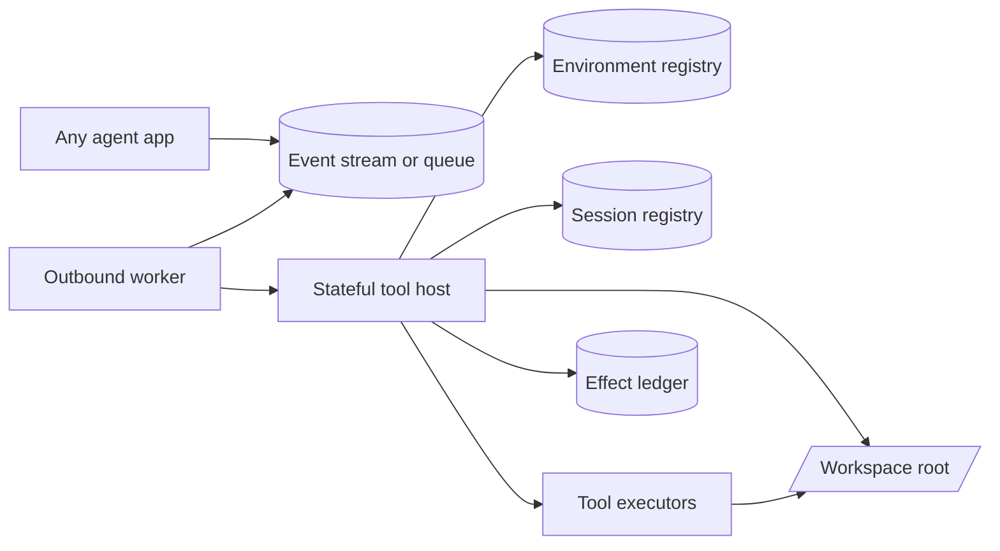
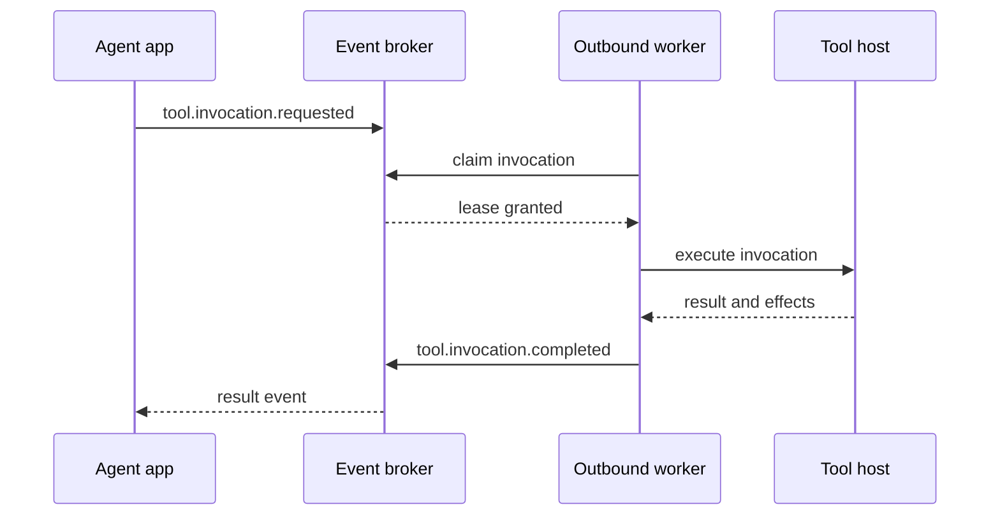

# Architecture

Substrate is built as its own execution layer. Agent applications integrate with it
through a narrow client boundary. The execution layer is Rust because it owns OS
resources and will eventually be where stronger isolation hooks live.



## Standalone Workspace

The standalone Rust workspace owns:

- Environment creation, attachment, closure, and destruction.
- Session creation, attachment, closure, and destruction within environments.
- Workspace root resolution and `/workspace` logical path mapping.
- Tool invocation execution.
- Policy enforcement for filesystem, process, and environment access.
- Effect recording.
- Worker protocol for pull-based execution.
- HTTP and Unix socket host transports.

It does not own:

- Agent planning.
- LLM message construction.
- Context window policy.
- Agent-specific permission UX.
- Agent-specific tracing views.

## Crate Boundaries

`executioner-core`

The foundational crate. It has no HTTP or broker coupling. It owns protocol
types, session lifecycle, workspace resolution, effect recording, and primitive
tool implementations. The Rust tool surface mirrors the current built-in
tool names: `Read`, `Write`, `Edit`, `List`, `Glob`, `Grep`, and `Bash`.

`executioner-host`

An HTTP transport over `executioner-core`. The same core can later be exposed
through Unix sockets or embedded directly in another process.

`executioner-worker`

Defines broker and host client traits plus the worker loop. The worker is not
coupled to one broker implementation or to a local host. The crate includes a
file-backed broker for local development and tests, but the core worker only
depends on `InvocationBroker` and `ToolHostClient`.

`executioner-cli`

Operational entry point. It can start a host, call a host, run a worker daemon,
or process one queued invocation and exit.

## Tool Host

The tool host is the stateful local authority. It should usually run on the same
machine or container as the workspace it controls.

Responsibilities:

- Create an environment-scoped workspace.
- Attach one or more sessions to that environment.
- Bind the workspace to a stable logical root: `/workspace`.
- Validate and normalize paths.
- Execute primitive tools.
- Serialize tool execution per environment so multiple sessions share one
  mutable workspace through an ordered stream.
- Enforce session policy.
- Record durable effects.
- Return a semantic result for agent consumption.

The first implementation exposes HTTP. The core is transport-neutral so Unix
socket support can be added without changing session or tool semantics.

## Outbound Worker

The worker is a bridge between a broker and a host. It connects outward, claims
jobs, executes them through a host client, and publishes results.



The worker abstractions are lease-shaped. `FileBroker` moves requests through:

```text
pending -> claimed -> completed | failed
```

Malformed pending files and files with invalid invocation ids are quarantined
under `rejected` so one bad local file cannot stop a worker from claiming later
valid work. Worker ids are validated before claiming and must be ASCII
identifier strings containing only letters, numbers, `_`, and `-`.

The file-backed broker atomically moves a pending file into a private claiming
file before parsing it, then writes the claimed envelope only after validation.
That keeps concurrent local workers from claiming the same pending file.
Completed and failed events must echo the claimed `attemptId` and `leaseToken`;
stale or forged worker results are rejected.
Invocation ids are single-use across pending, claimed, completed, and failed
states in the file-backed broker.
Workers also verify that host results match the claimed invocation and session
before completing the claim; mismatches are recorded as failed invocations for
the original claim.

Production brokers should preserve the same claim/lease shape rather than
passively subscribing. A lease allows the system to retry abandoned work without
allowing two workers to execute the same mutation concurrently.

## Effect Ledger

Effects describe durable state transitions at the abstraction level the substrate
chooses to model.

Examples:

- `file.write` for a workbook file changed on disk.
- `artifact.updated` for a generated report artifact.
- `process.exec` for a shell command.
- `network.request` for a future mediated outbound request. Network mediation is
  not implemented yet, so sessions must keep network policy disabled.

Effects are not the same as success or failure. A failed process can still write
a file before exiting. A successful read can have no durable effects.

The agent usually receives the semantic output and summary. The control plane,
audit system, cache invalidator, and UI can consume the full ledger.
