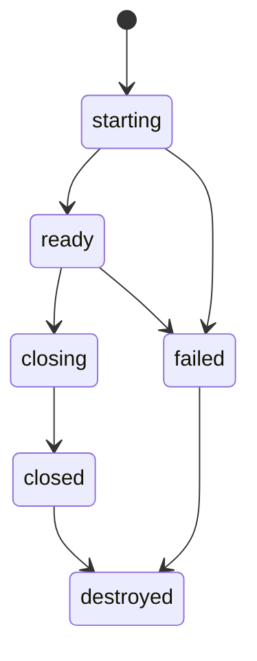
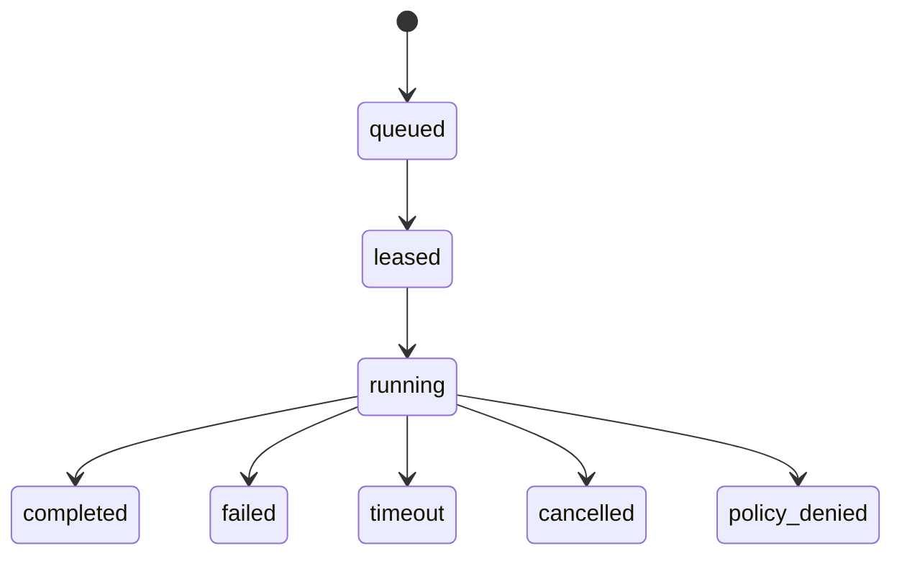

# Environment And Session Lifecycle

Environments are the resource boundary: they own the workspace, policy ceiling,
TTL, artifacts, and revision. Sessions are participation boundaries: each
session attaches an actor or client workflow to one environment and each
invocation belongs to exactly one session. The current implementation supports
`new` and `existing` environment workspaces; `snapshot` and `template` remain
protocol states until the snapshot store exists.

Closing a session prevents new work through that participation context, but it
does not destroy the environment. Destroying an environment removes all attached
sessions and deletes the managed workspace. New sessions are always created
inside an existing environment; there is no session-create shortcut that
implicitly creates or owns an environment.



## Session Lifecycle


## Workspace Modes

`new`

Create an empty workspace for this environment.

`existing`

Bind an existing host directory as the environment workspace.

`snapshot`

Hydrate the workspace from a previously captured snapshot.

`template`

Create the workspace from a named template.

## Logical Workspace

The host should expose a stable logical root:

```text
/workspace
```

The real host path may be different:

```text
/tmp/executioner/environments/env_123/workspace
/Users/example/project
/var/lib/executioner/workspaces/env_123
```

Tools and agent-visible results should prefer logical paths. Host internals can
retain real paths for enforcement and execution.

The host rejects absolute host paths in tool arguments. Callers use relative
paths or `/workspace/...` logical paths. This avoids accidentally teaching agent
apps about host filesystem layout.

Process execution is separate from file-tool authorization. `Bash` is denied
unless `process.allowExec` is true and `process.allowedCommands` is non-empty.
For command-name entries such as `printf`, the host only accepts simple
workspace-relative invocations: shell control syntax and obvious host-path
escapes like `/tmp/file`, `../file`, and option-embedded paths are rejected.
Quoted or backslash-escaped shell fragments are rejected on this command-name
path because they can hide path structure from simple token scans.
Path-like arguments are resolved through the workspace resolver, so symlinks
that point outside the workspace are rejected too. Exact full-command entries
can still approve complex commands, so they should be treated as trusted,
reviewed exceptions rather than a sandbox. Blank `process.deniedCommands`
entries are ignored; non-empty deny entries still block commands containing that
text. `process.maxProcesses` is accepted only as a non-negative `u32`-sized
count; unsupported process-count enforcement fails closed instead of silently
running with broader process authority.

`Bash` processes do not inherit the host environment by default. The host clears
the child environment, copies only names listed in `policy.env.allowlist`, then
adds `policy.env.injected` values. Names in `policy.env.denylist` are removed
even if they are also allowlisted or injected. Invalid environment names or
values, such as entries containing NUL bytes, are ignored.

For `Bash`, duration limits are ceilings. The effective process timeout is the
minimum of the tool `timeout` argument, the invocation `timeoutMs`, and
`policy.maxDurationMs`.

Optional tool arguments that affect scope or limits fail closed when present
with the wrong type. For example, malformed numeric limits such as `maxBytes`,
`maxResults`, or `timeout`, and malformed booleans such as `includeHidden`,
`caseSensitive`, or `replaceAll`, return tool errors instead of falling back to
broader defaults. Optional string filters such as `Grep.glob`, `Grep.type`, and
`Grep.path` follow the same rule. `Read.startLine` and `Read.endLine` are
1-based; zero or inverted ranges are rejected before file access. Unknown
tool-specific arguments are rejected instead of ignored; `List` takes no
tool-specific arguments.
Discovery and search tools also enforce read policy on their starting root:
`List`, `Glob`, and `Grep path="."` require their effective `cwd` to be covered
by `readRoots` before enumerating entries or file contents.
`List` returns human-readable newline output for agents, and also includes the
exact entry strings in `metadata.entries` so SDK helpers do not have to parse
ambiguous filenames from display text.
SDK `listFiles` helpers require the underlying `List` invocation to succeed;
policy denials and other tool errors are surfaced as helper errors rather than
being collapsed into an empty list.

Requests with non-empty `requiredCapabilities` fail closed until Substrate has a
first-class capability registry. This prevents a caller from marking an
invocation as requiring extra authority while the current host silently executes
it as an ordinary tool call.
Session creation also rejects enabled or host-scoped network policy until
Substrate has a mediated network tool or OS-level network sandbox.

Requests with `idempotencyKey` also fail closed until the host has a durable
idempotency store. This avoids presenting a request as safe to retry while the
current implementation would execute duplicate side effects.

## Host API

```text
POST   /environments
GET    /environments/:environmentId
POST   /environments/:environmentId/close
DELETE /environments/:environmentId
POST   /environments/:environmentId/sessions
GET    /environments/:environmentId/effects
POST   /environments/:environmentId/artifacts/workspace

GET    /sessions/:sessionId
POST   /sessions/:sessionId/close
DELETE /sessions/:sessionId

POST   /sessions/:sessionId/invocations
GET    /sessions/:sessionId/invocations/:invocationId
```

The HTTP server currently stores environments and sessions in process memory and
writes managed workspaces under the host state directory. Destroying a managed
environment removes its workspace. Managed `new` workspaces must canonicalize
under the host state directory; preexisting symlinked environment/session or
workspace paths are rejected before creation so stale state cannot redirect a
managed workspace outside host-owned storage. Existing workspaces are never
deleted by destroy. SDK and worker HTTP clients cap successful JSON response
bodies at 10 MiB and error response bodies at 64 KiB before including them in
errors, so remote host responses cannot become unbounded SDK payloads or
diagnostics.

The SDK makes this explicit with lifecycle config:

```text
CloseBehavior::DestroyEnvironment  -> mark environment destroyed; remove managed workspace
CloseBehavior::CloseEnvironment    -> mark environment closed; preserve managed workspace

QueueCleanup::Preserve         -> leave file broker directories for audit/debug
QueueCleanup::DeleteOnClose    -> remove the SDK-owned queue directory on close
```

SDK close first stops managed workers, then closes or destroys the environment,
and only then applies queue or state-directory cleanup. That order avoids a
managed worker processing queued work against an environment that is already
being destroyed.

Workspace cleanup and queue cleanup are separate. A managed `new` workspace is
owned by the host environment lifecycle. A file-backed broker queue is owned by the
SDK/backend lifecycle. An `existing` workspace is caller-owned and is preserved
even when the environment is destroyed. JS and Python SDKs only delete managed host
state directories by default when they created the temporary state directory;
caller-provided `stateDir` values are preserved unless cleanup is explicitly
enabled.

If an environment is created with `ttlMs`, the host treats it as expired after
that duration. Expired managed environments are purged on the next host
operation and their managed workspace is removed. Existing workspaces are not
removed by TTL purge, for the same reason they are not removed by explicit
destroy.
TTL values above one year, or values that cannot be represented by the host
clock, are rejected before any managed workspace is created.

## Workspace Artifacts

A workspace can be exported while the environment exists:

```text
POST /environments/:environmentId/artifacts/workspace
```

The host writes a deterministic tar archive and a JSON manifest under the host
state directory for that environment. The response includes file URIs for both
files, archive size, archive hash, counts, and per-entry hashes for regular
files. Exports are capped at 10,000 workspace entries before tar or manifest
files are finalized. Workspace paths that would require backslash separators are
rejected during export instead of being rewritten into different archive paths.
Safe symlinks are recorded in the manifest but are not followed into the
archive. Only relative symlink targets that stay inside the workspace are
included; absolute targets, targets with backslash separators, and relative
targets that would escape the workspace are omitted to avoid leaking, rewriting,
or recreating host paths.

Artifact materialization verifies the artifact format, resource types, archive
hash and byte length, manifest entry counts, the same 10,000-entry cap,
absolute `file://` resource URIs, and that each `logicalPath` matches its
`archivePath`. It rejects manifest or
tar paths that are absolute or contain parent traversal or backslash separators,
refuses to extract unexpected tar entries, requires manifest files and
directories to be present in the archive, rejects entries whose parent
directories are absent from the manifest, rejects incomplete symlink manifest
entries, and only recreates manifest symlinks whose relative targets stay inside
the destination workspace. Manifest resource URIs must use `file://`; when the
local manifest file is present, materializers cap it at 10 MiB before parsing
and verify it matches the artifact metadata being materialized.
Extraction happens in a sibling staging directory and is promoted to the
requested destination only after the archive and manifest have been fully
validated, so rejected artifacts do not leave partial workspace files behind.
The Rust, TypeScript, and Python SDKs expose this materialization flow.

## Invocation Lifecycle



The broker-side lifecycle and host-side lifecycle can be stored separately, but
they should share the same invocation id.

The initial file-backed broker stores this lifecycle as directories:

```text
pending/
claimed/
completed/
failed/
rejected/
```

`claimed` files include the worker id, attempt id, and lease token. Worker ids
use the same identifier shape as session and invocation ids: ASCII letters,
numbers, `_`, and `-`, up to 128 bytes. Malformed pending files and files with
invalid invocation ids are moved to `rejected` instead of blocking the queue.
This is not intended to be the final production broker, but it keeps the local
development path honest about pull-worker ownership. A worker must echo the
claimed attempt id and lease token when it reports completion or failure.
Manually added pending requests that omit an invocation id are assigned one at
claim time, and the claimed envelope stores the normalized request so workers
and terminal events use the same identity.
Invocation ids are single-use in the file-backed broker: enqueue rejects ids
that already exist in pending, claimed, completed, or failed state, and manually
added duplicates are moved to `rejected`. Completion and failure publication
also fail closed if either terminal state already exists, preserving terminal
events as immutable history. Terminal event reads and writes also validate the
expected event type, so `completed` only accepts `tool.invocation.completed` and
`failed` only accepts `tool.invocation.failed`.
Queue JSON entries must be regular files. Symlinks and other non-regular queue
entries are quarantined before the broker reads them, so a writable queue cannot
redirect workers to request or terminal JSON outside the queue directory.
Queue JSON entries are capped at 10 MiB before broker or SDK file-queue reads;
oversized pending or terminal files are rejected or quarantined instead of being
parsed.
Queue state directories such as `pending`, `claimed`, `completed`, `failed`,
and `rejected` must be real directories; symlinked state directories are
rejected during broker or SDK queue initialization.
The SDK file-queue wait loops apply the same regular-file and expected-event-type
checks to terminal events before returning results to callers. SDK pending
request publication also uses no-clobber writes and treats dangling queue
symlinks as occupied invocation ids.
Terminal files for invocations that are still present in `pending` are
quarantined instead of returned, so a forged completion or failure cannot
preempt worker claim ownership.
When a claim still exists, terminal reads also validate the event attempt id,
lease token, and session against the claimed envelope before returning it.

## Minimum Session Request

The current host always mounts the selected root at `/workspace`. Session
creation rejects unsupported workspace combinations, including
`mountAsWorkspace: false`, `root` on `mode: "new"`, and snapshot/template
references on modes that do not consume them.

```json
{
  "workspace": {
    "mode": "new",
    "mountAsWorkspace": true
  },
  "policy": {
    "readRoots": ["/workspace"],
    "writeRoots": ["/workspace"],
    "process": {
      "allowExec": true,
      "maxProcesses": 0
    },
    "network": {
      "enabled": false
    },
    "maxDurationMs": 300000,
    "maxOutputBytes": 100000
  }
}
```
